# 🎮 Tic Tac Toe — Cross-platform Online Game

## 🧩 Introduction

**Tic Tac Toe** is a cross-platform application that brings the classic "X and O" game to life with modern online features. The architecture is modular and split into three key components:

- **Tic_Tac_Toe** — Native mobile client written in **Swift**.
- **account_service** — Node.js/TypeScript microservice for user management and authentication.
- **GamerServer** — WebSocket server for real-time multiplayer gameplay using **Socket.IO**.

This separation allows better scalability and reduced load on individual services.

---

## ⚙️ Features

### 🔐 1. Registration & Authentication

- **Sign Up** with email and password.
- **Email verification** after registration.
- **Login** using secure credentials.
- **Password recovery** via email.
- Session handling and token management.

### 📜 2. Match History

- View previous matches with:
  - Win/Loss/Draw status.
  - Match date and opponent.
  - Final result.

### 🏆 3. Player Rating

- Elo-like rating system:
  - Points are **gained** for victories.
  - Points are **lost** after defeats.
- Rankings are updated in real time.

### 🔍 4. Opponent Matching

- Random matchmaking using the GamerServer.
- Match starts once an opponent is found.

### 🌐 5. Online Gameplay

- Real-time multiplayer powered by **WebSocket** (Socket.IO).
- Turn synchronization across devices.
- Automatic disconnection handling.

### 🎯 6. Game Logic

- Classic 3x3 Tic Tac Toe grid.
- Turn order: `X → O`.
- Win conditions:
  - 3 matching symbols in a row, column, or diagonal.
- Draw when the board is full with no winner.
- Option to play against a **bot (AI opponent)**.

### ✅ 7. Victory & Draw Detection

- Server-side win/draw check after every move.
- Prevents cheating and enforces fair play.

### 🏁 8. Game Over Handling

- Game ends with:
  - A winner message.
  - A draw message if applicable.
- Match result is stored in MongoDB and affects player rating.

---

## 🛠️ Tech Stack

### Backend

- **Node.js + TypeScript** — Core backend logic.
- **Express** — RESTful API for auth service.
- **Socket.IO** — Real-time WebSocket communication.
- **MongoDB** — Database for users, matches, sessions.

### Frontend (Mobile App)

- **Swift** — Native iOS development.

---

## 📚 Diagrams

The following diagrams describe the system:

- **Use Case Diagram** — Describes user interactions such as sign up, login, play, view history, and ranking.
  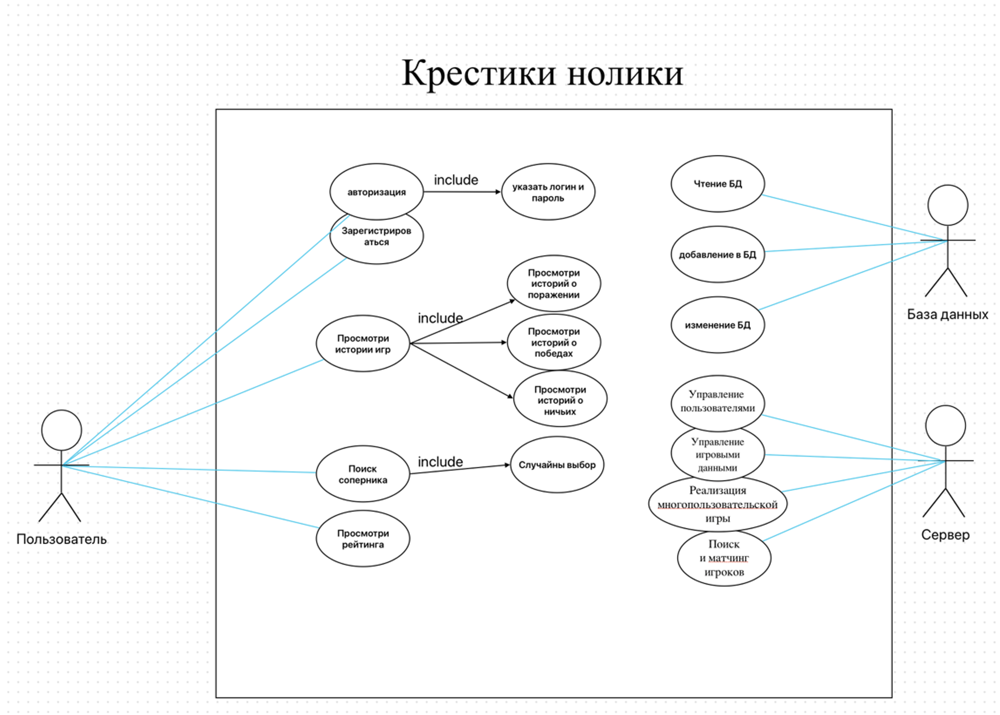

  
- **Class Diagram** — Contains system classes like `User`, `GameSession`, `MatchHistory`.
  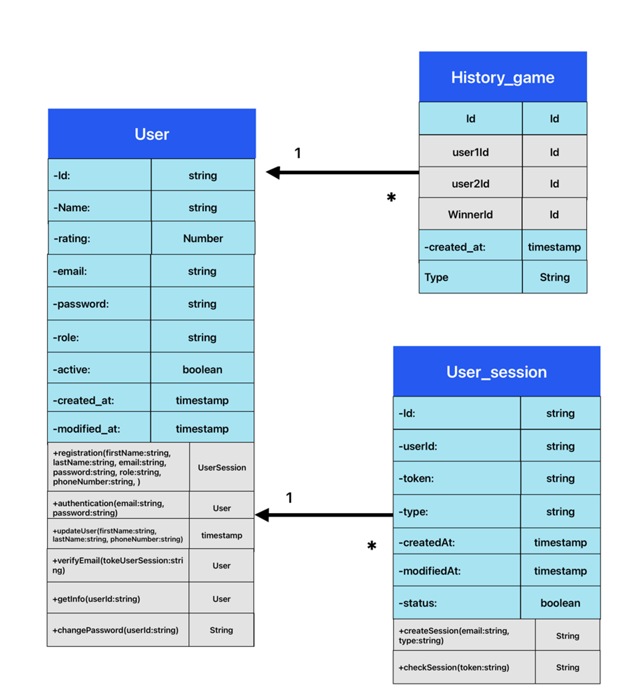

  
- **Sequence Diagram** — Describes the interaction between the client, account service, and game server during gameplay.
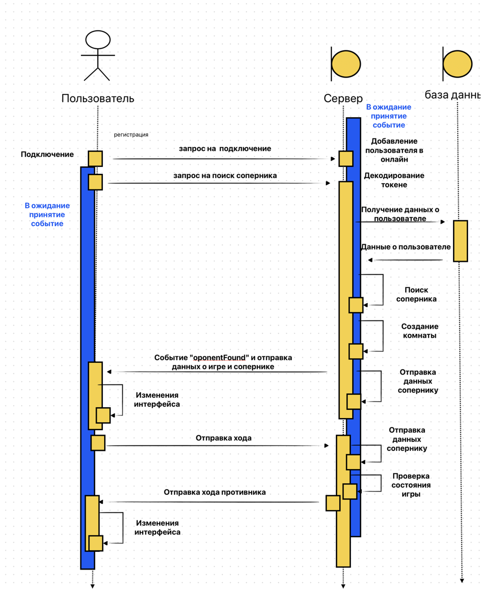

---

## 🖼️ Screenshots

### Main Menu

### Register and Login pages

 
  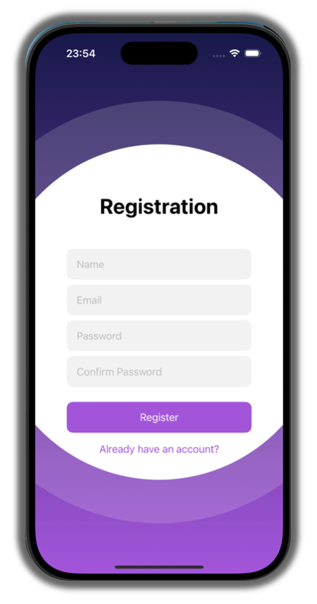
  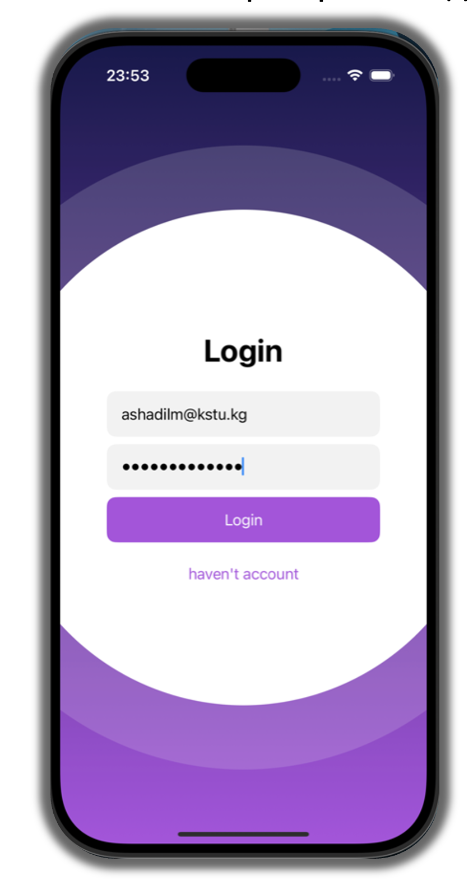

### Rang List and game history

 
  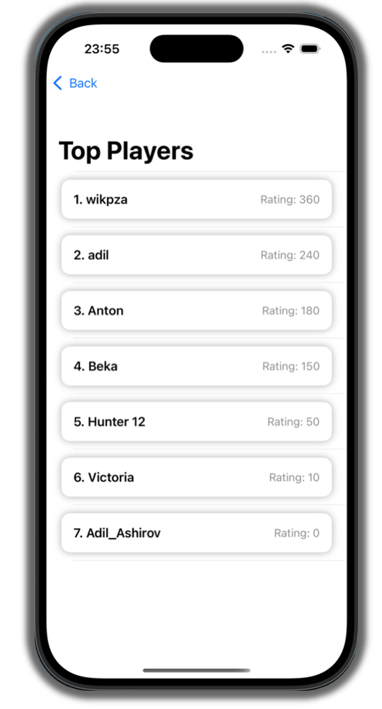
  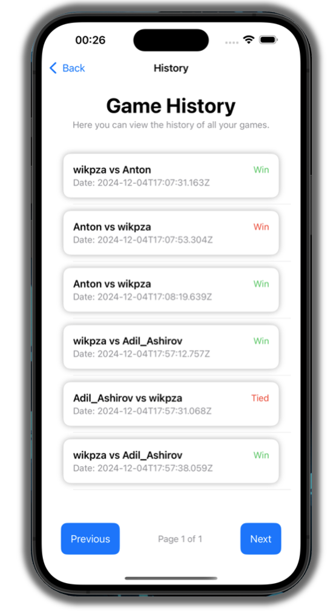

### Match Screen
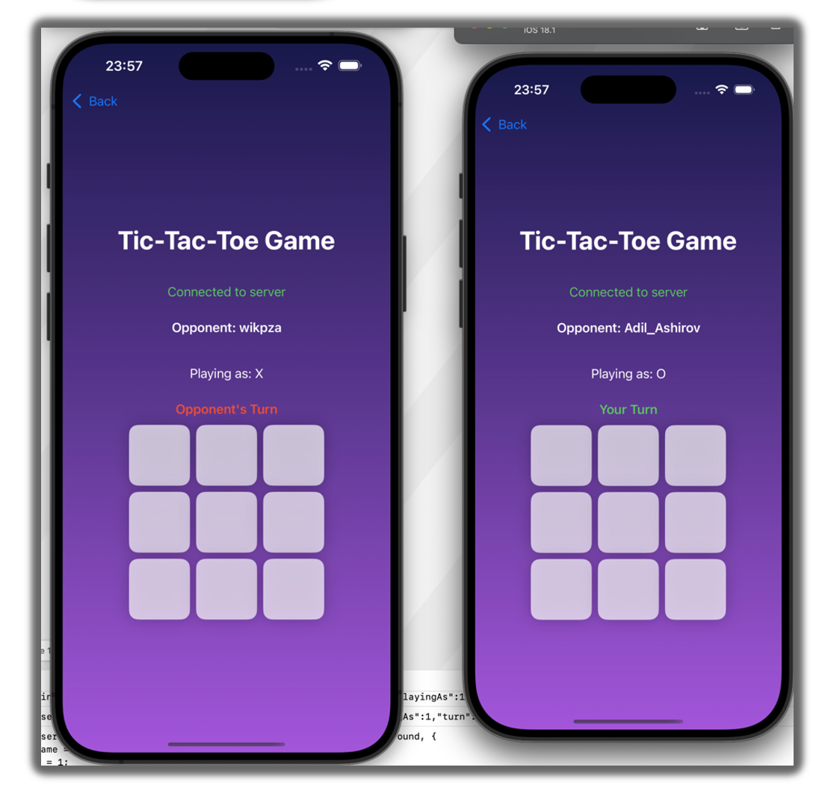

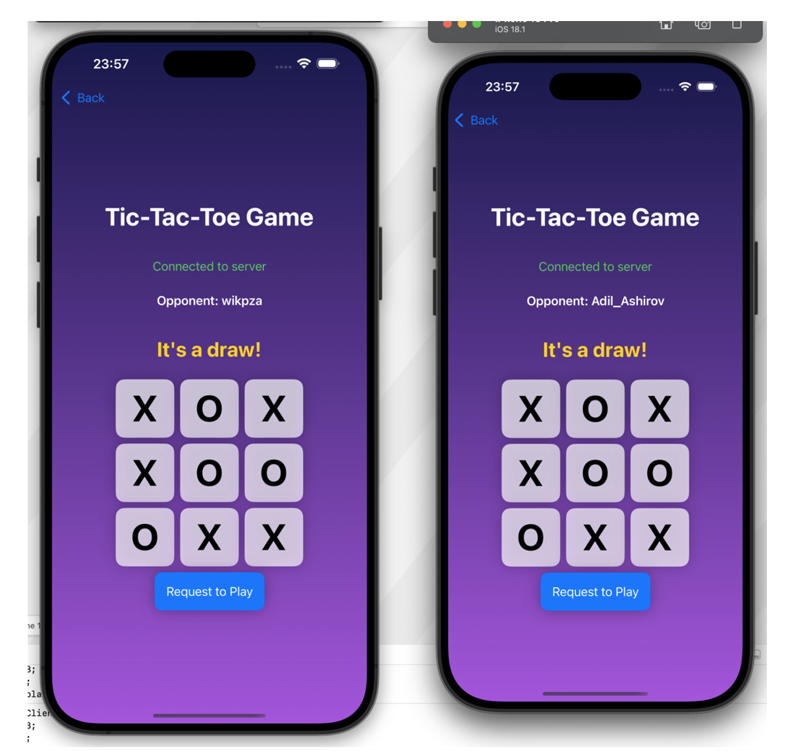

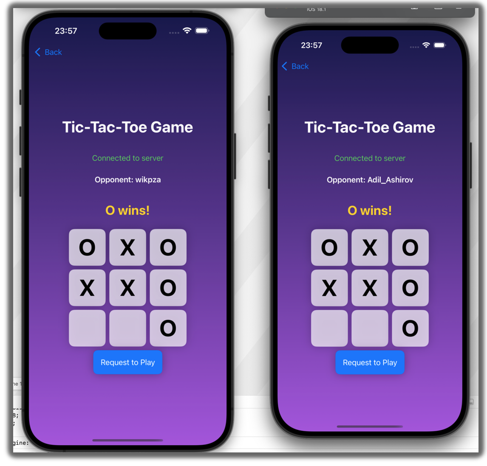

### Bot Game
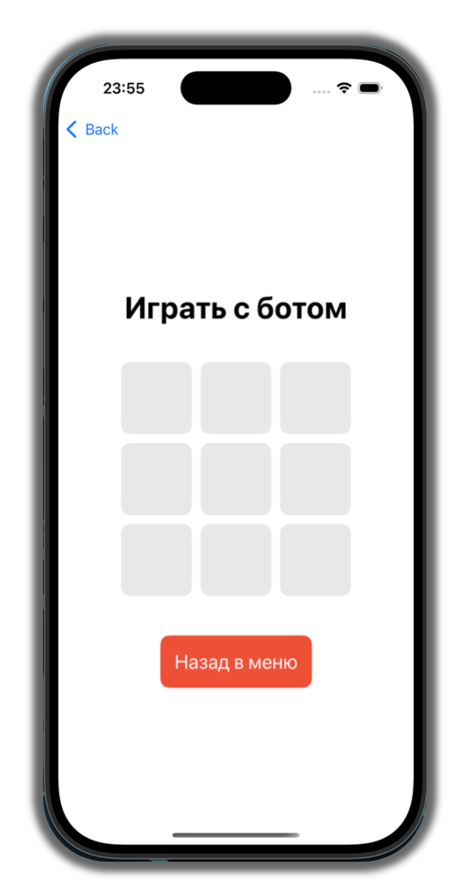

---

